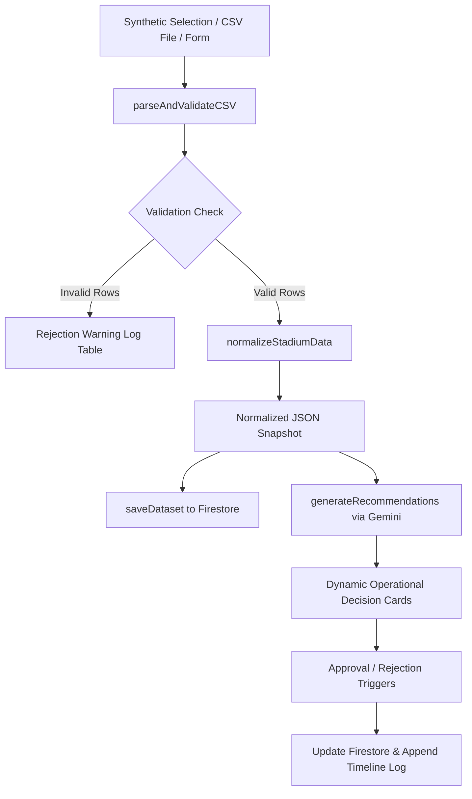

# StadiumOps AI - FIFA World Cup 2026 Command Center

StadiumOps AI is a production-grade, real-time Operational Decision Support and Crowd Management platform built for FIFA World Cup 2026 organizers and stadium operations managers. It integrates telemetry logs, CSV parsing pipelines, and Google's Gemini models to provide actionable, explainable crowd-control decisions.

---

## 1. System Architecture

The project is structured using clean, modular architectural layers:
- **Frontend Core**: React (v19) + Vite (v8) + Tailwind CSS (v4) with native `@tailwindcss/vite` integration.
- **Routing Shell**: Client-side state routing using React Router.
- **Telemetry Charts**: Responsive visualization cards rendered via Recharts.
- **Cognitive Layer**: Google Gemini REST integration with direct client-side fetch failovers to prevent browser bundle packaging locks.
- **Database Layer**: Cloud Firestore (saving datasets, recommendations, timeline logs) with `localStorage` backup buffers for standalone offline capabilities.

---

## 2. Technical Stack

- **Framework**: React 19, Vite 8, React Router v6
- **Styling**: Tailwind CSS v4
- **Visualizations**: Recharts (dynamic area crowd charts, gate bar load levels)
- **Icons**: Lucide React
- **API Connectivity**: Native REST fetch protocol to Google Gemini 1.5 Flash
- **Database / Logs**: Firebase Cloud Firestore with automatic `localStorage` local failovers

---

## 3. Ingestion & Validation Data Flow



1. **Ingest**: Managers upload a CSV, select a synthetic dataset, or submit override incident logs.
2. **Parse & Validate**: The `csvParser.js` runs validation rules:
   - Rejects negative queue wait times.
   - Rejects occupancy metrics above 100%.
   - Rejects rows with missing Gate IDs.
   - Rejects invalid HH:MM timestamps.
   - Captures invalid rows in a Validation Warning Log.
3. **Normalize**: `dataNormalizer.js` collapses valid records into a standardized JSON operational snapshot.
4. **Cognitive Call**: The snapshot is processed by `geminiService.js` (with a local Simulation mode fallback if API keys are missing).
5. **UI Feed**: Renders dynamic decision cards and updates the chronological Timeline Log.

---

## 4. Prompt Engineering Strategy

The system prompt is maintained separately in [stadiumSystemPrompt.js](file:///d:/PromptWar/Challenge-4/src/prompts/stadiumSystemPrompt.js) and implements version control headers.

### Why Gemini is Used
- **Low Latency Reasoning**: Rapid processing of multi-dimensional telemetry (crowd flow, weather forecasts, traffic delays, parking loads) to yield unified recommendations.
- **Schema-Enforced JSON Output**: Configured with `responseMimeType: "application/json"` to ensure the model outputs valid JSON conforming to the structural parameters.

### JSON Output Schema Specification
Gemini is instructed to behave as a decision support engine, not a chatbot. Structured JSON is enforced to allow direct mapping of variables into React visual components (wait times, steward counts, safety risks).

---

## 5. Local Setup Instructions

### Prerequisites
- Node.js (v18 or higher)
- npm (v9 or higher)

### Installation
1. Clone or copy the repository files.
2. Install dependencies:
   ```bash
   npm install
   ```
3. Set up environment variables. Copy `.env.example` to `.env` in the root:
   ```env
   VITE_GEMINI_API_KEY=your_gemini_api_key_here
   # Optional Firebase Configs:
   VITE_FIREBASE_API_KEY=
   VITE_FIREBASE_AUTH_DOMAIN=
   VITE_FIREBASE_PROJECT_ID=
   ```
4. Launch the local development server:
   ```bash
   npm run dev
   ```
5. Build production bundle:
   ```bash
   npm run build
   ```

---

## 6. Three-Minute Presentation Demo Script

Use this script to present the project to the judges smoothly:

1. **Introduction (30s)**: Introduce StadiumOps AI as a real-time command deck for FIFA World Cup 2026 organizers. Highlight that it is a decision support engine, not a chatbot.
2. **Load Scenario (30s)**: Click **Data Sources** in the sidebar. Highlight the Gemini Live vs Simulation connectivity badge. Under **Synthetic Scenario Ingestor**, choose **Heavy Rain** and click **Ingest & Run GenAI Analysis**.
3. **Live Telemetry & AI Recs (45s)**: Go back to the **Dashboard**. Point out the drifting metrics (updating every 8 seconds), the Recharts area chart plotting 30 points, and the generated decision cards.
4. **Traceability Explanation (30s)**: Click **Explain Decision** on the Critical weather alert card. Show the judges the **Telemetry Signals Triggered** panel, proving which sensors triggered the warning, why it was chosen, and the confidence details.
5. **Close the Loop (30s)**: Click **Approve** on the recommendation. Point out the outcome simulation: the target gate queue wait times drop, the incident disappears, and the timeline audit log updates.
6. **Report Export (15s)**: Go to **Reports**, choose **GenAI Decision & Reasoning Export**, generate it, and download the report txt file showing the complete digital audit trail.

---

## 7. Expected Judge Q&A Prep

### Q: Why did you choose this architecture?
**A:** We decoupled the parsing logic (`csvParser.js`), the normalizer (`dataNormalizer.js`), the streaming coordinator (`recommendationEngine.js`), and the cognitive AI requests (`geminiService.js`). This ensures that UI components are isolated, rendering metrics dynamically from a centralized data bus without loading locks.

### Q: How does live telemetry simulation work?
**A:** When a dataset is loaded, a background interval is initialized. Every 8 seconds, it applies realistic mathematical drifts (Gate queues $\pm$1–3m, Occupancy $\pm$1–2%, Staffing $\pm$0–1) within logical bounds. It then recalculates averages, re-queries Gemini/Simulator, and dispatches a custom browser event to update all views.

### Q: How does it handle invalid CSV data?
**A:** The parser implements strict cell-by-cell validation. If a row has negative queue wait times, occupancy above 100%, or mismatched columns, it rejects that row and appends it to a visible validator warning table. It normalizes only the valid rows, preserving backward compatibility without breaking the dashboard.

### Q: How could this connect to real stadium sensors in the future?
**A:** The coordinator communicates via a standard JSON snapshot. To connect to physical camera check lines, turnstile loops, or parking barriers, we would replace the CSV ingestor with a polling service or WebSocket subscriber that fetches telemetry from stadium IoT gateways and calls `recommendationEngine.processNewDataset()` automatically.
