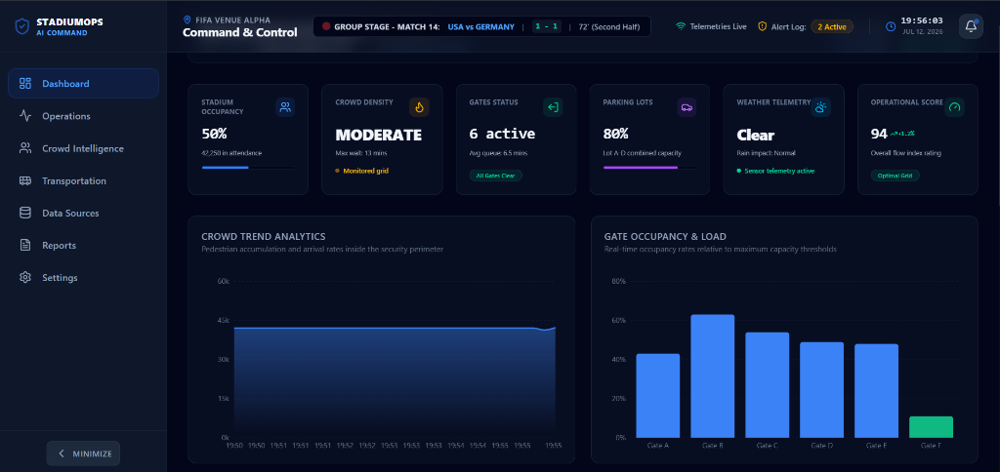
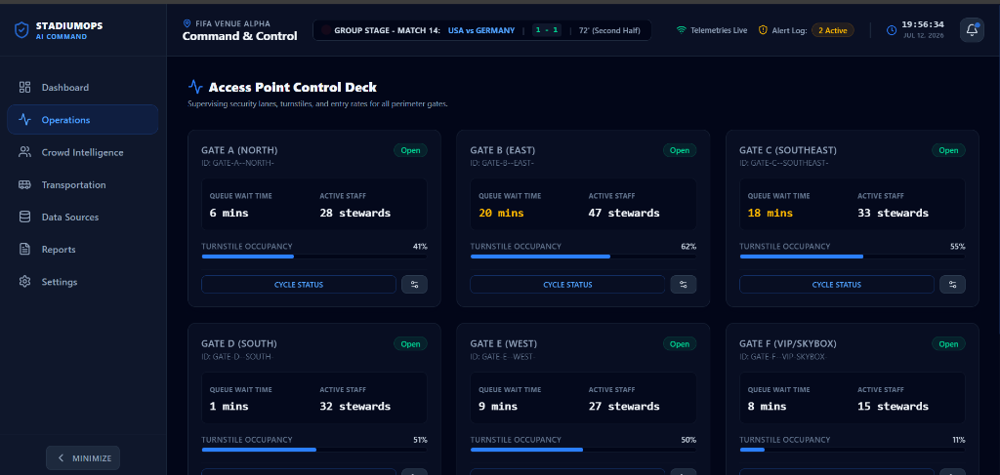
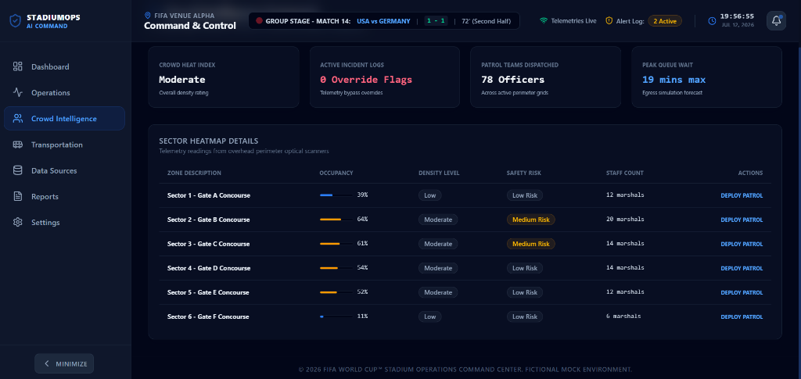
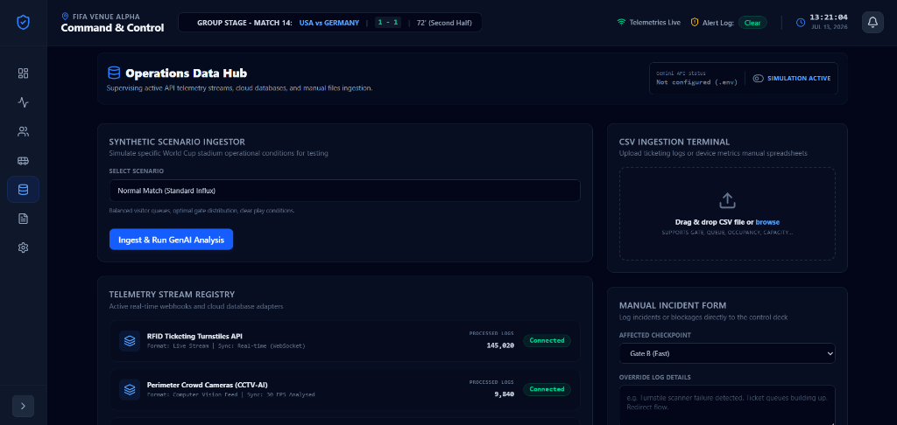
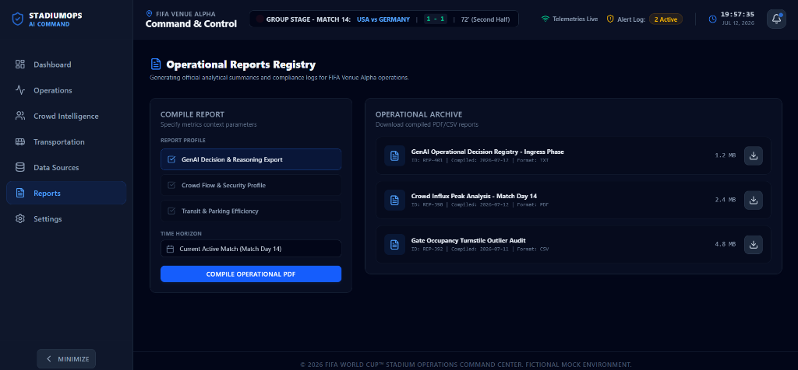

# StadiumOps AI - FIFA World Cup 2026 Command Center


StadiumOps AI is an AI-assisted operational decision-support platform designed for FIFA World Cup 2026 scenarios that continuously evaluates stadium telemetry to generate explainable recommendations for crowd management, safety, and resource allocation.

## Live Demo
👉 **[https://stadiumops-ai.vercel.app](https://stadiumops-ai.vercel.app)**

---

## Table of Contents
- [Project Overview](#1-project-overview)
- [Project Highlights](#2-project-highlights)
- [Project Screenshots](#3-project-screenshots)
- [Core Features](#4-core-features)
- [System Architecture](#5-system-architecture)
- [Project Folder Structure](#6-project-folder-structure)
- [Local Installation & How to Run](#7-local-installation--how-to-run)
- [Environment Variables](#8-environment-variables)
- [Quick Demo Walkthrough](#9-quick-demo-walkthrough)
- [Tested & Supported Browsers](#10-tested--supported-browsers)
- [Acknowledgements](#11-acknowledgements)
- [License](#12-license)

---

## 1. Project Overview

StadiumOps AI is an operational decision-support platform designed for FIFA World Cup 2026 scenarios that evaluates multi-dimensional stadium telemetry to highlight bottlenecks, trigger emergency responses, and model crowd-control outcomes.

*Note: Live operational telemetry is simulated for demonstration purposes. The architecture is designed so simulated inputs can be replaced with real-time IoT, ticketing, or sensor feeds without changing the recommendation workflow.*

---

## 2. Project Highlights

✔ **Live Telemetry Simulation**: Drifts metrics every 8 seconds to mimic a real digital twin.
✔ **Explainable AI (XAI)**: Shows exact metric triggers (e.g. wait times, alarms) inside decision rationales.
✔ **Closed-Loop Outcome Simulation**: Drains queues, redirects flow, and clears active incidents instantly on approval.
✔ **High-Reliability CSV Validation**: Captures, lists, and displays validation warning logs before ingestion.
✔ **Optional Firebase + Offline Failover**: Firestore enhances persistence. If Firebase credentials are absent, StadiumOps AI automatically falls back to local storage.
✔ **One-Click Presentation Mode**: Runs a complete automated storyboard in one click for judging.
✔ **Vercel Static Hosting**: Fast production builds with zero-config serverless deployments.

---

## 3. Project Screenshots

### Dashboard Command Deck

*Figure 1: Main command deck showing real-time Recharts trends, status grids, and occupancy rates.*

### Operations Control Deck

*Figure 2: Access Point Control Deck supervising security wait times, turnstile loads, and marshal allocations.*

### Crowd Intelligence Command

*Figure 3: Concourse Heatmap details showing crowd density indexes, Safety Risk ratings, and patrol counts.*

### Operations Data Hub

*Figure 4: Data Sources hub for CSV validation parsing warnings, manual override forms, and synthetic scenarios.*

### Operational Reports Registry

*Figure 5: Reports compiler supporting GenAI Decision and Reasoning structured logs export.*

---

## 4. Core Features

| Feature | Description |
| :--- | :--- |
| **Live Telemetry** | Simulates realistic operational drift (Queues, Occupancy, Parking, Transit) every 8 seconds. |
| **Explainable AI** | Opens a cognitive panel mapping the specific metrics that triggered each AI recommendation. |
| **Outcome Simulation** | Applies approved actions in the telemetry coordinates and models queue reduction outcomes. |
| **CSV Validation** | Parses spreadsheet formats, rejects errors (negative values, bad times), and normalizes rows. |
| **Report Export** | Compiles current KPIs, recommendations, reasoning, timelines, and audit logs into a text report. |
| **Demo Mode** | Automates ingestion, AI dispatches, approvals, outcomes, and report downloads in one click. |

---

## 5. System Architecture

The application decouples parsing, state coordinating, and cognitive reasoning into distinct layers:

```
    [ CSV / Synthetic Scenario ]
                 │
                 ▼
          [ CSV Validator ]
                 │
                 ▼
         [ Data Normalizer ]
                 │
                 ▼
      [ Recommendation Engine ]
           │           │
           ▼           ▼
      [ Gemini ]  [ Simulation ]
           │
           ▼
     [ React Dashboard ]
           │
           ▼
     [ Reports & Audit ]
```

- **Frontend Core**: React (v19) + Vite (v8) + Tailwind CSS (v4) with native `@tailwindcss/vite` integration.
- **Cognitive Layer**: Google Gemini REST integration with direct client-side fetch failovers to prevent browser bundle packaging locks.
- **Gemini Fallback (Simulation Mode)**: If no Gemini API key is configured in the environment, StadiumOps AI automatically switches to Simulation Mode, allowing the application to remain fully functional for demonstrations and evaluation.
- **Database Layer**: Cloud Firestore (saving datasets, recommendations, timeline logs) with `localStorage` backup buffers for standalone offline capabilities.

---

## 6. Project Folder Structure

```
src
├── assets/            # Vite graphics & screenshots
├── components/
│   ├── common/        # Reusable UI containers (Card, Badge, Button)
│   ├── dashboard/     # Recharts visualizers & timeline modules
│   └── layout/        # Layout shells (Header, Sidebar, Shell)
├── data/              # Synthetic CSV scenarios
├── pages/             # Page views (Dashboard, Operations, Crowd, Transit, Reports)
├── prompts/           # Version-controlled system prompt
├── services/          # API adapters (Gemini, Firebase, CSV Validator)
└── utils/             # Staging & drift stream engine
```

---

## 7. Local Installation & How to Run

### Prerequisites
- Node.js (v18 or higher)
- npm (v9 or higher)

### Setup Steps
1. Clone or copy the repository files.
2. Install dependencies:
   ```bash
   npm install
   ```
3. Set up environment variables. Copy `.env.example` to `.env` in the root:
   ```env
   VITE_GEMINI_API_KEY=your_gemini_api_key_here
   # Optional Firebase Configs:
   VITE_FIREBASE_API_KEY=
   VITE_FIREBASE_AUTH_DOMAIN=
   VITE_FIREBASE_PROJECT_ID=
   ```
4. Launch the local development server:
   ```bash
   npm run dev
   ```
5. Build production bundle:
   ```bash
   npm run build
   ```

---

## 8. Environment Variables

The application reads from `.env` in the root:
- `VITE_GEMINI_API_KEY`: Used to query the live Gemini 1.5 Flash model. If not present, the system defaults to Simulation Mode.
- `VITE_FIREBASE_API_KEY`: Used to connect to Google Cloud Firestore. If missing, all databases route to local storage.

---

## 9. Quick Demo Walkthrough

Use the built-in demo to walk through a complete operational scenario:

1. **Ingest Scenario**: Go to **Data Sources** in the sidebar. Click **Ingest & Run GenAI Analysis** under the Synthetic Scenario Ingestor (defaults to *Normal Match*).
2. **Review Decisions**: Return to the **Dashboard** to view calculated AI recommendations and drifting telemetry.
3. **Traceability**: Click **Explain Decision** to inspect which telemetry values triggered the recommendation.
4. **Outcome**: Click **Approve** and observe the gate queues draining and active incident flags clearing in real-time.
5. **Download Report**: Go to **Reports**, choose **GenAI Decision & Reasoning Export**, and click **Download** to save the complete decision audit log.

---

## 10. Tested & Supported Browsers

- Chrome (v110 or higher)
- Edge (v110 or higher)
- Firefox (v110 or higher)
- Safari (v16 or higher)

---

## 11. Acknowledgements

- **Google Gemini**: Dynamic operational reasoning models
- **React**: Frontend application architecture
- **Vite**: Rapid asset compilation server
- **Tailwind CSS**: Modern styled CSS theme configurations
- **Firebase**: Multi-regional real-time database synchronization
- **Recharts**: Responsive telemetry data visualization

---

## 12. License

This project is licensed under the MIT License - see the LICENSE file for details.
*(Created for PromptWars 2026 Evaluation purposes only).*
