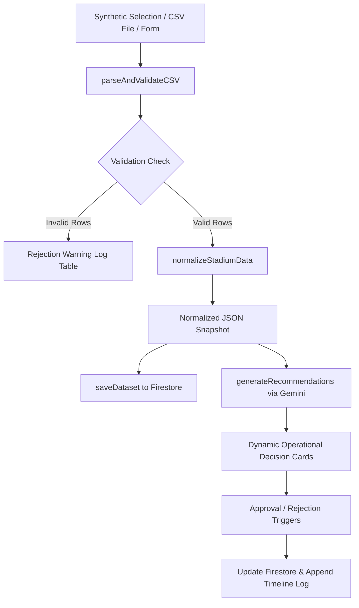

# StadiumOps AI - FIFA World Cup 2026 Command Center

### Live Production Deployment
- **Vercel Production URL**: [https://stadiumops-ai.vercel.app](https://stadiumops-ai.vercel.app)
- **Local Dev URL**: [http://localhost:5173/](http://localhost:5173/)

---

## 1. Project Overview

StadiumOps AI is a production-grade, real-time Operational Decision Support and Crowd Management platform built for FIFA World Cup 2026 organizers and stadium operations managers. It integrates telemetry logs, CSV parsing pipelines, and Google's Gemini models to provide actionable, explainable crowd-control decisions.

Unlike standard query-based chatbots, StadiumOps AI functions as an autonomous decision support console, evaluating multi-dimensional stadium telemetry to highlight bottlenecks, trigger emergency responses, and simulate operational outcomes.

---

## 2. Key Features

- **Ingress Telemetry Coordinator**: Real-time evaluation of gate queue wait times, turnstile capacity load ratios, and perimeter traffic parameters.
- **Explainable Decision Engine**: Integrates Google Gemini 1.5 Flash to generate context-aware dispatches, accompanied by a dynamic breakdown of the exact metrics that triggered the warning.
- **Closed-Loop Outcome Simulator**: Approving an AI recommendation dynamically resolves wait times, clears incidents, and routes crowd traffic, updating KPIs and charts in real-time.
- **Pre-Normalization CSV Preview**: Validates custom CSV uploads row-by-row, catching negative parameters or invalid timestamps, and displaying structural grids before committing to AI analysis.
- **Presentation Demo Mode**: A one-click simulation script that automates scenario loading, anomaly triggers, approvals, and report generation for judging presentations.
- **Offline LocalDb Failover**: Integrates Firebase Cloud Firestore with automatic local storage failovers for full standalone compatibility.

---

## 3. System Architecture

The project is structured using clean, modular architectural layers:
- **Frontend Core**: React (v19) + Vite (v8) + Tailwind CSS (v4) with native `@tailwindcss/vite` integration.
- **Routing Shell**: Client-side state routing using React Router.
- **Telemetry Charts**: Responsive visualization cards rendered via Recharts.
- **Cognitive Layer**: Google Gemini REST integration with direct client-side fetch failovers to prevent browser bundle packaging locks.
- **Database Layer**: Cloud Firestore (saving datasets, recommendations, timeline logs) with `localStorage` backup buffers for standalone offline capabilities.



---

## 4. Technical Stack & Project Structure

### Tech Stack
- **Framework**: React 19, Vite 8, React Router v6
- **Styling**: Tailwind CSS v4
- **Visualizations**: Recharts (dynamic area crowd charts, gate bar load levels)
- **Icons**: Lucide React
- **Cognitive Analysis**: Google Gemini 1.5 Flash REST API

### Project Structure
```
src/
  assets/              # Vite graphics
  components/
    common/            # Reusable UI containers (Card, Badge, Button)
    layout/            # Layout shells (Header, Sidebar, Shell)
    dashboard/         # Recharts visualizers & timeline modules
  data/                # Synthetic CSV scenarios
  pages/               # Page views (Dashboard, Operations, Crowd, Transit, Reports)
  prompts/             # Version-controlled system prompt
  services/            # API adapters (Gemini, Firebase, CSV Validator)
  utils/               # Staging & drift stream engine
```

---

## 5. Local Installation & How to Run

### Prerequisites
- Node.js (v18 or higher)
- npm (v9 or higher)

### Setup Steps
1. Clone or copy the repository files.
2. Install dependencies:
   ```bash
   npm install
   ```
3. Set up environment variables. Copy `.env.example` to `.env` in the root:
   ```env
   VITE_GEMINI_API_KEY=your_gemini_api_key_here
   # Optional Firebase Configs:
   VITE_FIREBASE_API_KEY=
   VITE_FIREBASE_AUTH_DOMAIN=
   VITE_FIREBASE_PROJECT_ID=
   ```
4. Launch the local development server:
   ```bash
   npm run dev
   ```
5. Build production bundle:
   ```bash
   npm run build
   ```

---

## 6. Environment Variables

The application reads from `.env` in the root:
- `VITE_GEMINI_API_KEY`: Used to query the live Gemini 1.5 Flash model. If not present, the system defaults to simulation mode.
- `VITE_FIREBASE_API_KEY`: Used to connect to Google Cloud Firestore. If missing, all databases route to `localStorage`.

---

## 7. Quick Demo Walkthrough

Use the built-in demo to walk through a complete operational scenario:

1. **Ingest Scenario**: Go to **Data Sources** in the sidebar. Click **Ingest & Run GenAI Analysis** under the Synthetic Scenario Ingestor (defaults to *Normal Match*).
2. **Review Decisions**: Return to the **Dashboard** to view calculated AI recommendations and drifting telemetry.
3. **Traceability**: Click **Explain Decision** to inspect which telemetry values triggered the recommendation.
4. **Outcome**: Click **Approve** and observe the gate queues draining and active incident flags clearing in real-time.
5. **Download Report**: Go to **Reports**, choose **GenAI Decision & Reasoning Export**, and click **Download** to save the complete decision audit log.

---

## 8. Future Improvements

- **Real-Time IoT Integrations**: Transition the data bus from CSV ingestion to real-time WebSockets subscribing to gate turnstile loops and camera passenger flows.
- **Enhanced Predictive Analytics**: Integrate ML models to forecast pedestrian arrival surges up to 60 minutes in advance using shuttle schedule offsets.
- **Multimodal AI Reasoning**: Allow operations managers to upload live drone/CCTV feed screenshots to analyze concourse blockages directly.
