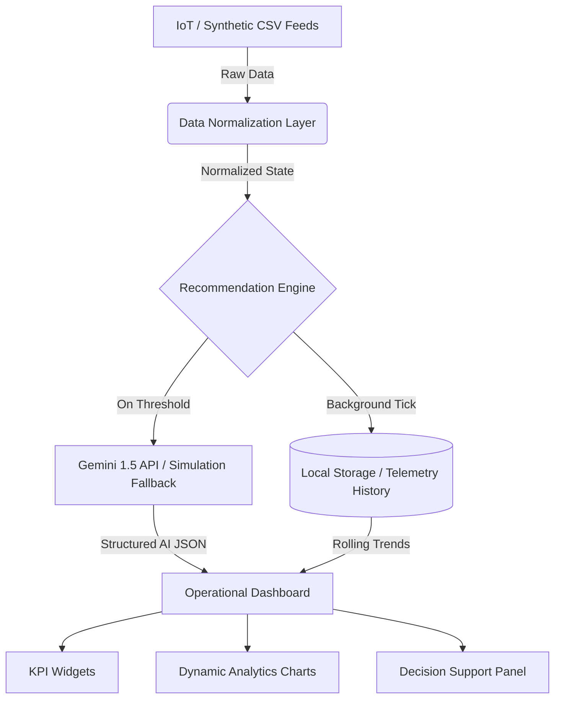

# Stadium Operations Command Center — System Architecture

This document outlines the core architecture, data flows, component hierarchies, and engineering decisions that power the Stadium Operations Command Center.

## System Architecture

The application is a pure client-side React dashboard that orchestrates live IoT telemetry, synthetic simulations, and Generative AI reasoning to produce actionable operational directives in real-time.



---

## Component Hierarchy

The Dashboard operates purely as an orchestrator, delegating state management and event subscriptions to custom hooks.

```text
Dashboard (Orchestrator)
 ├── Hooks (State Management)
 │    ├── useTelemetry (Core State)
 │    ├── useAiRecommendations (AI Lifecycle)
 │    └── useTerminalLogger (Timeline Events)
 │
 ├── Components (Presentation)
 │    ├── KPISection
 │    │    ├── VisitorCard
 │    │    ├── ParkingCard
 │    │    └── GatesStatusCard
 │    ├── TelemetryChartPanel
 │    ├── RecommendationPanel
 │    │    └── RecommendationCard
 │    ├── StatusTerminal
 │    └── IntelSection
 │
 └── Utilities & Services (Logic)
      ├── recommendationEngine (Background Ticks)
      ├── geminiService (AI Inference)
      └── dataNormalizer (ETL)
```

---

## Telemetry Flow

The flow of operational data begins with dataset ingestion and flows through a deterministic engine that maintains a rolling history buffer for trend prediction.

1. **CSV Upload / Demo Trigger**
2. **Normalization:** Transforms flat raw data into nested structural formats (e.g., categorizing gates, context, and incidents).
3. **Recommendation Engine (Tick):** Appends the new snapshot to a rolling 30-tick history.
4. **Trend Calculation:** Calculates rate of change (`delta`) and linear regression predictions.
5. **AI Analysis:** Dispatches the enriched snapshot to Gemini for evaluation.
6. **Dashboard:** Listens for the `stadiumops-telemetry-update` custom event to trigger an instant re-render.

---

## AI Pipeline

The Generative AI engine operates as an independent decision-support layer, analyzing not just the immediate snapshot but historical velocity.

```text
Telemetry Snapshot
       ↓
Historical Evidence (Rolling Buffer)
       ↓
Trend Detection (Deltas & Regression)
       ↓
Prediction
       ↓
Confidence Scoring
       ↓
Structured Output (JSON)
       ↓
Recommendation Panel rendering
```

---

## Folder Structure

```text
src/
├── components/          # Reusable UI elements grouped by feature
│   ├── common/          # Low-level atoms (Buttons, Badges, Cards)
│   └── dashboard/       # High-level feature blocks
├── hooks/               # Custom React hooks containing operational logic
├── pages/               # Route-level orchestrator components
├── prompts/             # Prompt engineering and JSON Schema definitions
├── services/            # External integrations (Gemini, Firebase)
├── styles/              # Global CSS and Tailwind definitions
└── utils/               # Pure functions (Math, Formatters, Normalizers)
```

---

## Engineering Decisions

### Why React Hooks?
By migrating state logic out of components and into dedicated hooks (`useTelemetry`, `useAiRecommendations`), we achieved strict separation of concerns. This allows components to remain purely presentational, significantly improving maintainability and testability.

### Why `responseSchema`?
Enforcing a deterministic `responseSchema` via the Gemini SDK ensures 100% parseable JSON without brittle regex parsing. It forces the LLM to adhere to the strict operational ontology required by the `RecommendationCard` UI.

### Why a Rolling Telemetry Buffer?
To enable predictive intelligence (calculating rate of change and linear regression), the engine must maintain historical context. A rolling 30-tick buffer keeps memory consumption negligible `O(1)` while providing a statistically significant sample size for accurate forecasting.

### Why was State Refactoring Deferred?
While global state solutions like Context or Zustand could replace local event listeners, they were deemed an unnecessary architectural risk for the competition deadline. The current event-driven `localStorage` pattern is stable, performant, and preserves the hackathon prototype's operational speed.
